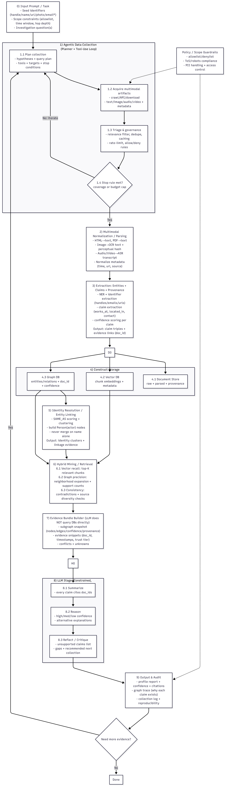

# LLM-OSINT

LLM-OSINT is a local-first OSINT research stack built around a Fastify API, a Streamable HTTP MCP server, and Python LangGraph graphs for evidence collection and report generation.

## What is in the repo

- `apps/api`: Fastify API for runs, events, files, graph views, and report retrieval
- `apps/mcp-server`: MCP server with deterministic ingest tools and Python-backed research tools
- `apps/web`: React + Vite analyst UI
- `services/agent-langgraph`: Stage 1 planner/tool-worker graphs and Stage 2 report graph
- `services/worker-python`: deterministic text chunking and embedding helpers
- `services/worker-temporal`: Temporal worker skeleton
- `services/worker-embedding`: local vLLM embedding service
- `infra/docker`: Docker Compose stack for local development
- `infra/db/migrations`: Postgres schema migrations

## Current runtime flow

1. `POST /runs` creates a run.
2. The API autostarts `services/agent-langgraph/src/run_planner.py`.
3. The API passes `--run-stage2`, so successful API-launched runs execute Stage 1 and then Stage 2 by default.
4. Stage 1 calls MCP tools, stores evidence, emits receipts, and updates vector/graph stores.
5. Stage 2 writes report snapshots to Postgres and the API exposes them at `GET /runs/:runId/report`.

## Core services

- API: `http://localhost:3000`
- MCP server: `http://localhost:3001/mcp`
- Kali/preset MCP server: `http://localhost:3002/mcp`
- Web UI: `http://localhost:5173`
- MinIO console: `http://localhost:9001`
- Neo4j browser: `http://localhost:7474`
- Temporal UI: `http://localhost:8233`

## Quick start

```bash
cp .env.example .env
yarn install
yarn infra:up
```

If you are running inside the VS Code dev container, connect it to the compose network once:

```bash
docker network connect docker_default $(hostname) || true
```

Run migrations:

```bash
PG_CID=$(docker compose -f infra/docker/docker-compose.yml ps -q postgres)
for f in infra/db/migrations/*.sql; do
  docker exec -i "$PG_CID" psql -U osint -d osint < "$f"
done
```

Start the web app:

```bash
yarn dev:web
```

Health check:

```bash
curl http://localhost:3000/health
```

Create a run:

```bash
curl -X POST http://localhost:3000/runs \
  -H "Content-Type: application/json" \
  -d '{"prompt":"Investigate example.com and related accounts"}'
```


## Related docs

- `SETUP.md`: full setup and verification
- `ENV_FILES_README.md`: environment template guidance
- `ENV_CONFIGURATION_SUMMARY.md`: environment behavior summary
- `Checkpoint.md`: current repository checkpoint
- `PROJECT_PLAN_TODO.md`: remaining work
- `pipeline_structure.md`: Stage 1 / Stage 2 runtime structure
